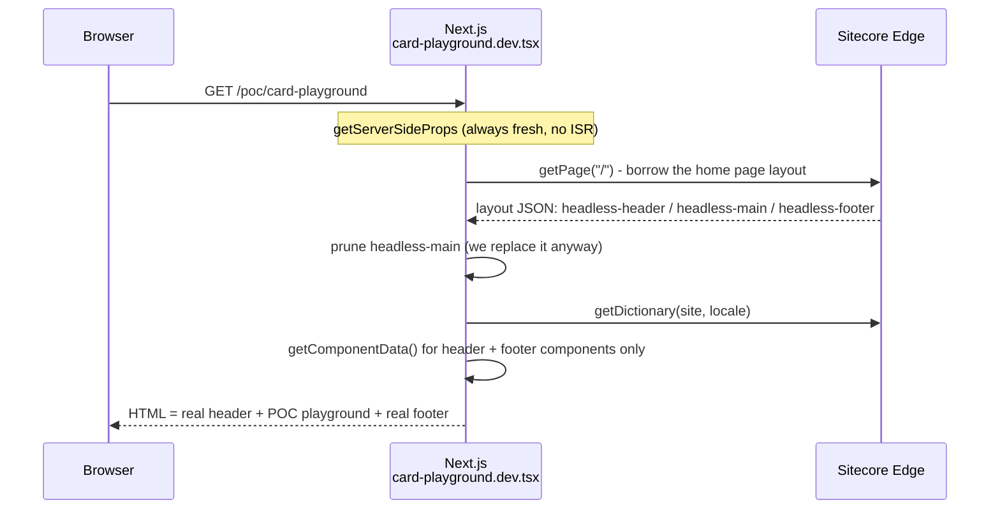

import PocPageComposition from '@/components/jsx/poc-page-composition'

Getting a component in front of product owners and designers, inside the real site, before the content model settles usually means a template, a rendering, a datasource, a page item, and a publish to Edge in every environment you want to demo in, plus the cleanup afterwards. On our SitecoreAI (formerly XM Cloud) build, we skip all of that with a reserved file extension.

> TLDR: Name POC pages `*.dev.tsx` under `pages/poc/` and only add `dev.tsx` / `dev.ts` to `pageExtensions` outside production. Every developer gets a shareable `/poc/<name>` URL on lower environments that borrows a real Sitecore page's header, footer, styles, and dictionary, without creating a single Sitecore item. The catch: in the Pages Router, `demo.dev.tsx` still ends in `.tsx`, so a production build doesn't drop the page, it just moves it to `/poc/demo.dev`. Strip `.dev` pages in your production CI build and add a post-build guard. The App Router doesn't have this problem.

Verified on Next.js 16.2 (Pages Router, webpack build), Sitecore Content SDK 2.0.2, and Node 24.

## The Convention

POC, demo, and manual-test pages live under `src/pages/poc/` with a `.dev.tsx` (or `.dev.ts`) extension, so `src/pages/poc/card-playground.dev.tsx` becomes `/poc/card-playground`. Every environment except PROD adds the `dev.*` extensions to [`pageExtensions`](https://nextjs.org/docs/pages/api-reference/config/next-config-js/pageExtensions):

```js {7-9,13} showLineNumbers
// next.config.js
/**
 * `.dev.tsx` / `.dev.ts` pages are routable in every environment except PROD,
 * so POC and test pages ship to DEV/QA/UAT for review.
 * NOTE: for the Pages Router this is not enough on its own; see "strip-dev-pages".
 */
const isProd = process.env.NEXT_PUBLIC_ENV === "PROD";
const baseExtensions = ["tsx", "ts", "jsx", "js"];
const pageExtensions = isProd ? baseExtensions : [...baseExtensions, "dev.tsx", "dev.ts"];

/** @type {import('next').NextConfig} */
const nextConfig = {
  pageExtensions,
  // ...
};

module.exports = nextConfig;
```

- **Set the flag at build time.** `pageExtensions` is evaluated when `next build` runs, so `NEXT_PUBLIC_ENV` has to be a build arg, not just a runtime variable. If you promote one image across environments, you'll need a separate production build.
- **The `/poc/` prefix** makes these pages easy to spot in logs, exclude from the proxy, and assert against in CI.
- **No conflict with the Sitecore catch-all.** Next.js gives the static `/poc/card-playground` route priority over `[[...path]].tsx`.

## Why Bother With POC Pages?

Simply put,POC pages answer "does this work in the real site, with real data?"

|                                   | Sitecore test page (catch-all)                    | Storybook                | `.dev` POC page                     |
| --------------------------------- | ------------------------------------------------- | ------------------------ | ----------------------------------- |
| Setup                             | Template, rendering, datasource, item, publish    | Story file + mocks       | One `.tsx` file                     |
| Real header / footer / global CSS | Yes                                               | No (mocked at best)      | Yes (borrowed)                      |
| Real session / auth / APIs        | Yes                                               | Mocked                   | Yes                                 |
| Shareable URL                     | Yes                                               | If Storybook is deployed | Yes, lower environments only        |
| Cleanup                           | Delete items in every environment + serialization | Delete story             | Delete file                         |
| Author-editable                   | Yes                                               | No                       | No (by design)                      |
| Production risk                   | Content can get published                         | None                     | Only if the exclusion is broken     |

You can also build the React side before the content model settles, and a POC page can carry controls a CMS page can't: toggles, side-by-side variants, inputs that drive live API calls, payload inspectors. We use them for component playgrounds, API harnesses, session and context inspectors, pages that throw on purpose to test the 500 page, and smoke tests after an SDK upgrade. Storybook still owns isolated variants and visual regression; POC pages answer "does this work in the real site, with real data?"

## Borrowing the Real Header and Footer

Each POC page fetches a real Sitecore page's layout (normally the home page), renders its header, footer, styles, dictionary, and Sitecore context, and swaps the main content area for its own React components.

<PocPageComposition />

- To the Content SDK, a page is layout JSON: a `route` with named placeholders, typically `headless-header`, `headless-main`, and `headless-footer`.
- The header and footer come from SXA Partial Designs, so every page's layout already includes them. Any page can act as the "shell": render its header and footer placeholders, and put your own React tree where `headless-main` would go.
- Wrapping that in the catch-all's providers (`SitecoreProvider`, `ComponentPropsContext`, the `dictionary` prop) makes `useSitecore()`, server-side component props, and translations behave as they do on a CMS page.

### Step 1: Let `Layout.tsx` Accept Replacement Main Content

The only change to shared code. Normal Sitecore pages never pass the prop:

```tsx {9,12,23} showLineNumbers
// src/Layout.tsx (simplified; keep your existing head, scripts, design-library handling)
import type { JSX, ReactNode } from "react";
import { Placeholder, type Page } from "@sitecore-content-sdk/nextjs";
import SitecoreStyles from "src/components/content-sdk/SitecoreStyles";

interface LayoutProps {
  page: Page;
  /** When provided, replaces the main placeholder. POC pages use this to borrow the header and footer. */
  mainReplacementChildren?: ReactNode;
}

const Layout = ({ page, mainReplacementChildren }: LayoutProps): JSX.Element => {
  const { route } = page.layout.sitecore;

  return (
    <>
      <SitecoreStyles layoutData={page.layout} />
      <header>
        <div id="header">{route && <Placeholder name="headless-header" rendering={route} />}</div>
      </header>
      <main>
        <div id="content">
          {mainReplacementChildren ?? (route && <Placeholder name="headless-main" rendering={route} />)}
        </div>
      </main>
      <footer>
        <div id="footer">{route && <Placeholder name="headless-footer" rendering={route} />}</div>
      </footer>
    </>
  );
};

export default Layout;
```

If your head has more than one main placeholder, put them all behind the same check. Keeping the replacement inside `<main id="content">` means CSS and skip links that target `#content` still work.

### Step 2: Prune the Placeholders You're Replacing

`client.getComponentData()` runs `getComponentServerProps` for every component in the layout, including the home page's main-area components the POC never renders. Prune those placeholders first to skip the fetches and keep the unused JSON out of page props:

```ts
// src/poc/lib/without-placeholders.ts
import type { Page } from "@sitecore-content-sdk/nextjs";

/** Returns a copy of the page whose route no longer contains the named placeholders. */
export const withoutPlaceholders = (page: Page, names: readonly string[]): Page => {
  const route = page.layout.sitecore.route;
  if (!route) return page;

  const placeholders = Object.fromEntries(Object.entries(route.placeholders).filter(([name]) => !names.includes(name)));

  return {
    ...page,
    layout: {
      ...page.layout,
      sitecore: { ...page.layout.sitecore, route: { ...route, placeholders } },
    },
  };
};
```

### Step 3: One Shared `getServerSideProps` for Every POC Page

Rather than copying ~30 lines from the catch-all into every POC page:

```ts {18,24,29,30} showLineNumbers
// src/poc/lib/get-poc-server-side-props.ts
import type { GetServerSideProps } from "next";
import client from "lib/sitecore-client";
// @ts-ignore - generated by the Content SDK CLI at build time
import components from ".sitecore/component-map";
import { withoutPlaceholders } from "./without-placeholders";

/** Placeholders the POC page replaces, so we don't fetch server props for them. */
const REPLACED_PLACEHOLDERS = ["headless-main"] as const;

/** Item whose header/footer the POC borrows. Override per request with ?shell=/some/path. */
const DEFAULT_SHELL_PATH = "/";

export const getPocServerSideProps: GetServerSideProps = async (context) => {
  const { shell, site } = context.query;
  const shellPath = typeof shell === "string" ? shell : DEFAULT_SHELL_PATH;

  const fullPage = await client.getPage(shellPath, {
    locale: context.locale,
    site: typeof site === "string" ? site : undefined,
  });
  if (!fullPage) return { notFound: true };

  const page = withoutPlaceholders(fullPage, REPLACED_PLACEHOLDERS);

  return {
    props: {
      page,
      dictionary: await client.getDictionary({ site: page.siteName, locale: page.locale }),
      componentProps: await client.getComponentData(page.layout, context, components),
    },
  };
};
```

### Step 4: The POC Page

```tsx {15,19,27} showLineNumbers
// src/pages/poc/card-playground.dev.tsx
import type { JSX } from "react";
import Head from "next/head";
import type { SitecorePageProps } from "@sitecore-content-sdk/nextjs";
import Layout from "src/Layout";
import Providers from "src/Providers";
import CardPlayground from "src/poc/components/CardPlayground/CardPlayground";
import { getPocServerSideProps } from "src/poc/lib/get-poc-server-side-props";

const CardPlaygroundPage = ({ page, componentProps }: SitecorePageProps): JSX.Element | null => {
  if (!page) return null;

  return (
    <Providers page={page} componentProps={componentProps}>
      <Layout page={page} mainReplacementChildren={<CardPlayground />} />
      {/* After <Layout>: next/head keeps the last <title> rendered, so this overrides the shell's title. */}
      <Head>
        <title>POC: Card playground</title>
        <meta name="robots" content="noindex, nofollow" />
      </Head>
    </Providers>
  );
};

export default CardPlaygroundPage;

export const getServerSideProps = getPocServerSideProps;
```

### Step 5: A POC Component That Uses the Real Sitecore Context

Because POC components render inside the real providers, they can use the same hooks as production components:

```tsx {8-12,18,19} showLineNumbers
// src/poc/components/CardPlayground/CardPlayground.tsx
import { useState, type JSX } from "react";
import { useSitecore } from "@sitecore-content-sdk/nextjs";
import { useI18n } from "next-localization";
import PromoCard from "src/poc/components/PromoCard/PromoCard";

/** Mock fields in the exact shape the layout service returns, so promotion later is a drop-in. */
const MOCK_FIELDS = {
  heading: { value: "Spring product launch" },
  body: { value: "<p>Everything you need to know before launch day.</p>" },
  link: { value: { href: "/news", text: "Read more" } },
};

const VARIANTS = ["default", "compact", "featured"] as const;
type Variant = (typeof VARIANTS)[number];

const CardPlayground = (): JSX.Element => {
  const { page } = useSitecore();
  const { t } = useI18n();
  const [variant, setVariant] = useState<Variant>("default");

  return (
    <section className="container mx-auto py-8">
      <p>
        Site: {page.siteName} | Locale: {page.locale} | Dictionary check: {t("ReadMore")}
      </p>

      <fieldset>
        <legend>Variant</legend>
        {VARIANTS.map((option) => (
          <label key={option}>
            <input type="radio" name="variant" checked={variant === option} onChange={() => setVariant(option)} />{" "}
            {option}
          </label>
        ))}
      </fieldset>

      <PromoCard fields={MOCK_FIELDS} variant={variant} />
    </section>
  );
};

export default CardPlayground;
```

### How a Request Flows



### Gotchas

- **Be explicit about the source page.** `extractPath(context)` returns `'/'` on non-catch-all routes, so copying the catch-all's `client.getPage(extractPath(context), ...)` silently fetches the home page. `DEFAULT_SHELL_PATH` makes that visible.
- **Borrow a different page.** This option is pretty clever 😏 `?shell=/careers` previews the component under that section's header variant, breadcrumbs, or Page Design.
- **Multisite.** If POC routes skip the proxy, the `/_site_<name>/` rewrite never happens and `getPage()` falls back to `defaultSite` from `sitecore.config.ts`. Use `?site=` to borrow another site's header and footer.
- **Proxy.** We exclude `/poc/` from the proxy matcher so a POC can test the auth flow without depending on it. That leaves POC pages unauthenticated, which is why the production exclusion matters. If you don't need this, leave them behind auth.

  ```ts
  // src/proxy.ts (excerpt)
  export const config = {
    matcher: ["/", "/((?!api/|_next/|healthz|sitecore/api/|-/|favicon.ico|poc/).*)"],
  };
  ```

- **Keep `componentProps` and `dictionary`.** Header and footer components often fetch navigation in `getComponentServerProps`, so without `getComponentData()` and `ComponentPropsContext` the borrowed header renders empty. Returning `dictionary` lets `_app`'s `I18nProvider` serve `t()` to everything on the page.
- **Skip the preview code.** The Pages builder never opens POC pages, so the catch-all's preview and Design Library branches don't apply.

## Keeping POC Components Out of the Component Map

The Content SDK CLI (`sitecore-tools project component generate-map`) turns every `.js`, `.jsx`, `.ts`, and `.tsx` file under `componentMap.paths` (usually `src/components`) into an `import * as X` in `.sitecore/component-map.ts` ([docs](https://doc.sitecore.com/sai/en/developers/content-sdk/register-a-component-in-the-component-map.html)). That map is bundled into every Sitecore page and keyed by file name, so a POC component there ships to production and can collide with a real one. A POC `src/components/poc/Hero/Hero.tsx` next to the real `src/components/Hero/Hero.tsx` generates a duplicate import that fails to compile:

```ts
import * as Hero from 'src/components/poc/Hero/Hero';
import * as Hero from 'src/components/Hero/Hero';
// ...
  ['Hero', { ...Hero }],
  ['Hero', { ...Hero }],
```

### Option A (Recommended): Keep POC Components Outside `src/components`

```
src/poc/components/CardPlayground/CardPlayground.tsx
src/poc/lib/get-poc-server-side-props.ts
```

`src/poc` is never scanned, so there's no config change, and once `.dev` pages are stripped from production nothing imports it. `tsc`, Tailwind v4's automatic source detection, and Storybook's `src/**/*.stories.*` glob still see it (on Tailwind v3, add `./src/poc/**/*.{ts,tsx}` to `content`).

One catch: the loader that strips `getComponentServerProps` from client bundles usually only targets `src/components/**`, so POC components should get their data from the POC page's `getServerSideProps` instead.

### Option B: Keep Them Under `src/components/poc/` and Exclude Them

```ts {7,18,24} showLineNumbers
// sitecore.cli.config.ts
import { defineCliConfig } from "@sitecore-content-sdk/nextjs/config-cli";
import { generateSites, generateMetadata, extractFiles, writeImportMap } from "@sitecore-content-sdk/nextjs/tools";
import scConfig from "./sitecore.config";

/** POC-only components: imported directly by .dev pages, never rendered by Sitecore. */
const POC_COMPONENTS = "src/components/poc/**";

export default defineCliConfig({
  config: scConfig,
  build: {
    commands: [
      generateMetadata(),
      generateSites(),
      extractFiles(),
      writeImportMap({
        paths: ["src/components/content-sdk"],
        exclude: [POC_COMPONENTS], // only needed if paths includes src/components (App Router template does)
      }),
    ],
  },
  componentMap: {
    paths: ["src/components"],
    exclude: ["src/components/content-sdk/*", "**/*.stories.*", POC_COMPONENTS],
  },
});
```

`componentMap.exclude` patterns go straight to `glob`'s `ignore` option, relative to the project root ([CLI config docs](https://doc.sitecore.com/sai/en/developers/content-sdk/cli-commands-and-configuration.html)).

Either way, a CI check after map generation catches leaks:

```bash
# After `sitecore-tools project component generate-map`
if grep -q "/poc/" .sitecore/component-map.ts; then
  echo "POC components leaked into the Sitecore component map" && exit 1
fi
```

## The Plot Twist: `.dev.tsx` Still Ends in `.tsx`

With the production extension list (`['tsx', 'ts', 'jsx', 'js']`), `src/pages/poc/demo.dev.tsx` is **still compiled and routed**, at `/poc/demo.dev` instead of `/poc/demo`. A test Next.js 16.2.4 app built with the production list:

```text
Route (pages)
┌ ○ /
├ ○ /404
└ ○ /poc/demo.dev        <- the "excluded" POC page, live at a new URL
```

### Why It Happens

Next.js uses `pageExtensions` for two separate jobs in the Pages Router:

1. **Discovery.** Any file under `pages/` ending in one of the extensions is a page (`createValidFileMatcher().isPageFile`). `demo.dev.tsx` ends in `.tsx`, so it matches.
2. **Naming.** The route is the file path minus the longest matching extension (`getPageFromPath`). With `dev.tsx` in the list, that's `/poc/demo`. Without it, only `.tsx` is stripped, leaving `/poc/demo.dev`.

Removing `dev.tsx` from the list doesn't remove the page; it moves it. That's why a quick "`/poc/demo` 404s in production" check passes. In a real app, every POC page and everything it imports ships in the production build at `/poc/<name>.dev`, unauthenticated if `/poc/` skips the proxy, and `pages/api/**/*.dev.ts` routes leak the same way.

`pageExtensions` can't express "everything except `.dev`": the extensions are joined into one regex with no negative match. The [Next.js docs](https://nextjs.org/docs/pages/api-reference/config/next-config-js/pageExtensions) use it the other way around, giving every page a compound extension like `page.tsx`.

### The Fix: Strip `.dev` Pages Before the Production Build

**Option A (recommended): delete `.dev` pages before `next build` in CI.** Requiring both `CI` and `PROD` keeps a local production build from deleting your working files:

```js {5,7,16} showLineNumbers
// scripts/strip-dev-pages.mjs
import { readdir, rm } from "node:fs/promises";
import path from "node:path";

const DEV_PAGE = /\.dev\.(tsx?|jsx?)$/;

if (process.env.NEXT_PUBLIC_ENV !== "PROD" || !process.env.CI) {
  console.log("[strip-dev-pages] Not a CI production build; leaving .dev pages in place.");
  process.exit(0);
}

const pagesDir = path.resolve("src/pages");
const entries = await readdir(pagesDir, { recursive: true, withFileTypes: true });
const devPages = entries.filter((entry) => entry.isFile() && DEV_PAGE.test(entry.name));

await Promise.all(devPages.map((entry) => rm(path.join(entry.parentPath, entry.name))));
console.log(`[strip-dev-pages] Removed ${devPages.length} .dev page(s) before the production build.`);
```

**Option B: the same thing in the Dockerfile**, which only ever touches the image's copy of the source:

```dockerfile
ARG NEXT_PUBLIC_ENV
ENV NEXT_PUBLIC_ENV=$NEXT_PUBLIC_ENV
COPY nextjs/ .
# POC pages ship to lower environments only. pageExtensions alone does not exclude them (see post).
RUN if [ "$NEXT_PUBLIC_ENV" = "PROD" ]; then find src/pages -type f -name '*.dev.*' -print -delete; fi
RUN npm run build
```

### Always: A Post-Build Guard

Make the pipeline prove the exclusion. This guard reads the route manifests `next build` writes for both routers and fails a PROD build that contains a POC route:

```js
// scripts/assert-no-poc-routes.mjs
import { readFile } from "node:fs/promises";

/** Route manifests written by `next build`: one per router. A project may have either or both. */
const MANIFESTS = [".next/server/pages-manifest.json", ".next/server/app-paths-manifest.json"];

const isPocRoute = (route) => route.includes("/poc/") || /\.dev(\/|$)/.test(route);

if (process.env.NEXT_PUBLIC_ENV !== "PROD") {
  console.log("[assert-no-poc-routes] Not a PROD build; POC routes are expected. Skipping.");
  process.exit(0);
}

const leaked = [];
for (const file of MANIFESTS) {
  try {
    const manifest = JSON.parse(await readFile(file, "utf8"));
    leaked.push(...Object.keys(manifest).filter(isPocRoute));
  } catch {
    // Manifest not present for this router type.
  }
}

if (leaked.length > 0) {
  console.error("[assert-no-poc-routes] POC routes found in a PROD build:", leaked);
  process.exit(1);
}
console.log("[assert-no-poc-routes] OK: no POC routes in the PROD build.");
```

```json
// package.json (excerpt)
{
  "scripts": {
    "next:build": "node scripts/strip-dev-pages.mjs && next build && node scripts/assert-no-poc-routes.mjs"
  }
}
```

On the leaking build from earlier:

```text
[assert-no-poc-routes] POC routes found in a PROD build: [ '/poc/demo.dev' ]
```

## The Same Pattern in the App Router

App Router special files must be named exactly `page.<ext>`, `layout.<ext>`, `route.<ext>`, and so on, so with the production list `page.dev.tsx` isn't a page at all:

```text
# non-PROD (dev.* extensions included)      # PROD
Route (app)                                 Route (app)
┌ ○ /                                       ┌ ○ /
├ ○ /_not-found                             └ ○ /_not-found
└ ○ /poc/demo
```

No strip step needed (keep the guard anyway). `layout.dev.tsx` and `route.dev.ts` behave the same way, so you also get dev-only layouts and Route Handlers.

The Content SDK App Router template routes everything through `src/app/[site]/[locale]/[[...path]]/page.tsx`, and its proxy rewrites `/some/path` to `/<site>/<locale>/some/path`. So put POC routes under `[site]/[locale]/poc/`, and don't exclude `/poc/` from the proxy. The static `poc` segment beats the optional catch-all, and the POC picks up the header and footer of whichever site the hostname resolves to.

```text
src/app/
|- layout.tsx
`- [site]/
   |- layout.tsx
   `- [locale]/
      |- [[...path]]/page.tsx          # Sitecore catch-all
      `- poc/
         |- layout.dev.tsx             # borrows header/footer ONCE for every POC page
         `- card-playground/
            `- page.dev.tsx            # -> /poc/card-playground (non-PROD only)
```

One `layout.dev.tsx` renders the real header and footer around `{children}`, so there's no `mainReplacementChildren`, no per-page `getServerSideProps`, and no pruning:

```tsx {22,24,34,38,43} showLineNumbers
// src/app/[site]/[locale]/poc/layout.dev.tsx
import type { ReactNode } from "react";
import { notFound } from "next/navigation";
import { NextIntlClientProvider } from "next-intl";
import { setRequestLocale } from "next-intl/server";
import { AppPlaceholder } from "@sitecore-content-sdk/nextjs";
import client from "src/lib/sitecore-client";
import Providers from "src/Providers";
import SitecoreHead from "src/SitecoreHead";
import componentMap from ".sitecore/component-map";

type PocLayoutProps = {
  children: ReactNode;
  params: Promise<{ site: string; locale: string }>;
};

/** Borrows the home page's header and footer so every POC page looks like a real page on the site. */
export default async function PocLayout({ children, params }: PocLayoutProps) {
  const { site, locale } = await params;

  // Same as the catch-all: lets src/i18n/request.ts load this site's dictionary.
  setRequestLocale(`${site}_${locale}`);

  const page = await client.getPage([], { site, locale });
  const route = page?.layout.sitecore.route;
  if (!page || !route) notFound();

  return (
    <NextIntlClientProvider>
      <Providers page={page}>
        <SitecoreHead page={page} />
        <header>
          <div id="header">
            <AppPlaceholder page={page} componentMap={componentMap} name="headless-header" rendering={route} />
          </div>
        </header>
        <main>
          <div id="content">{children}</div>
        </main>
        <footer>
          <div id="footer">
            <AppPlaceholder page={page} componentMap={componentMap} name="headless-footer" rendering={route} />
          </div>
        </footer>
      </Providers>
    </NextIntlClientProvider>
  );
}
```

```tsx
// src/app/[site]/[locale]/poc/card-playground/page.dev.tsx
import type { Metadata } from "next";
import CardPlayground from "src/poc/components/CardPlayground/CardPlayground";

export const metadata: Metadata = {
  title: "POC: Card playground",
  robots: { index: false, follow: false },
};

export default function CardPlaygroundPage() {
  return <CardPlayground />;
}
```

To port `CardPlayground`, add `'use client'` and swap `useI18n()` for next-intl's `useTranslations()`. If a POC page calls next-intl server APIs itself, call `setRequestLocale` there too.

> [!NOTE]
> The App Router samples are adapted from the [Content SDK `nextjs-app-router` template](https://github.com/Sitecore/content-sdk/tree/dev/packages/create-content-sdk-app/src/templates/nextjs-app-router). The routing and `.dev` behavior were verified with real builds, but the layout file hasn't been run inside a Content SDK App Router app. Treat it as a starting point.

|                                     | Pages Router                                     | App Router                                   |
| ----------------------------------- | ------------------------------------------------ | -------------------------------------------- |
| File                                | `src/pages/poc/x.dev.tsx`                        | `src/app/[site]/[locale]/poc/x/page.dev.tsx` |
| PROD exclusion via `pageExtensions` | **Leaks** as `/poc/x.dev`, needs strip step      | Airtight                                     |
| Borrowing the header and footer     | `mainReplacementChildren` + per-page GSSP helper | One shared `layout.dev.tsx`                  |
| Proxy                               | Can skip `/poc/` (then site = `defaultSite`)     | Must run (locale + multisite rewrite)        |
| Multisite header and footer         | Explicit `site` option or `?site=`               | Automatic from hostname                      |
| Dev-only API                        | `pages/api/*.dev.ts` (same leak)                 | `route.dev.ts` (airtight)                    |

## In Summary

A reserved `.dev` extension gives every developer a cheap way to put a work-in-progress component in front of stakeholders, inside the real site, without creating anything in Sitecore. The part to get right is keeping those pages out of production. If you're setting this up yourself, here's what to put in place:

- Put POC pages under `src/pages/poc/` with a `.dev.tsx` extension (or `poc/<name>/page.dev.tsx` in the App Router).
- Add the `dev.*` extensions to `pageExtensions` in every environment except production, and set the environment flag at build time.
- In the Pages Router, delete the `.dev` pages in your production CI or Docker build, since `pageExtensions` alone won't drop them.
- Add the post-build guard so a production build fails if a `/poc/` route sneaks in.
- Keep POC components in `src/poc/` so they stay out of the Sitecore component map.
- Give every POC page a clear `<title>` and a `noindex` tag.

When a POC has done its job, promote it to a real Sitecore component, delete it, or keep it if it really means that much to you 😉